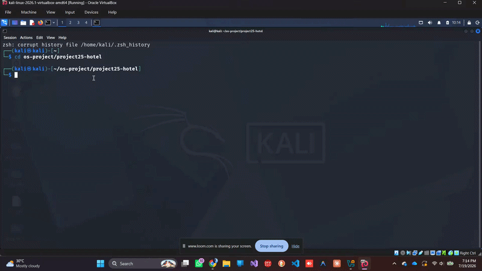
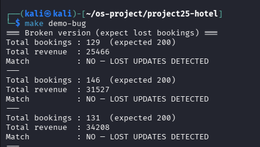
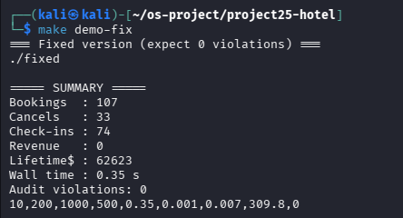
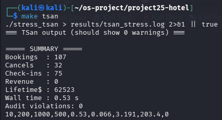
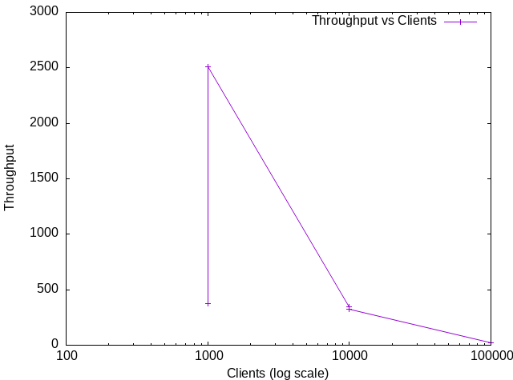

# 🏨 Multithreaded Hotel Reservation System
<!--


-->


Thread-safe hotel reservation system built in **C** using **POSIX Threads**, demonstrating synchronization, race condition detection, overbooking prevention, and concurrency stress testing.

---

## 🎥 Demo

> *(Embed a GIF here after you create one.)*



---

## 📸 Screenshots

| Broken Version | Fixed Version |
|---------------|---------------|
|  |  |

| Stress Test | ThreadSanitizer |
|-------------|-----------------|
|  |  |

---

## ✨ Features

- Multithreaded client simulation
- POSIX Threads (pthreads)
- Mutex-protected shared database
- Thread-safe statistics
- Room booking by category
- Date-overlap checking
- Revenue consistency verification
- Auditor thread
- Race condition demonstration
- Stress testing
- Helgrind verification
- ThreadSanitizer verification

---

## 🧠 Concepts Demonstrated

- Multithreading
- Mutual Exclusion
- Race Conditions
- Thread Safety
- Critical Sections
- Synchronization
- POSIX Threads
- Mutexes
- Concurrent Programming

---

## 🏗️ System Architecture

```text
                  +------------------+
                  |  Client Threads  |
                  +------------------+
                            |
         +-----------+-----------+-----------+
         |           |           |           |      
      Booking     Cancel      Query      Check-in
         |           |           |           |
         +-----------+-----------+-----------+
                         |
                  +--------------+
                  | db_mtx Mutex |
                  +--------------+
                         |
        +----------------+----------------+
        |                                 |
+--------------------+         +----------------------+
| Booking Database   |         | Shared Statistics    |
| • Rooms            |         | • Bookings           |
| • Categories       |         | • Revenue            |
| • Date Ranges      |         | • Check-ins          |
| • Active Bookings  |         | • Cancellations      |
+--------------------+         +----------------------+
        |                                 |
        +----------------+----------------+
                         |
                  +--------------+
                  | Auditor      |
                  | Thread       |
                  +--------------+
                         |
         +---------------+----------------+
         |                                |
  Overbooking Detection      Revenue Verification
```

---

## 📂 Project Structure

```text
.
├── .git/
├── results/
│   ├── all.csv
│   ├── broken_runs.log
│   ├── helgrind_broken.log
│   ├── helgrind_fixed.log
│   ├── tsan_stress.log
│   ├── SA.csv
│   ├── SB.csv
│   ├── SC.csv
│   ├── SD.csv
│   └── SE.csv
├── screenshots/
│   ├── demo.gif
│   ├── demo-bug.png
│   ├── demo-fix.png
│   ├── stress.png
│   ├── helgrind.png
│   ├── tsan.png
│   └── throughput.png
├── hotel_broken.c
├── hotel_fixed.c
├── hotel_stress.c
├── fixedbackup.c
├── Makefile
├── README.md
└── Report.pdf
```

---

## 🚀 Getting Started

### Clone

```bash
git clone https://github.com/yourusername/multithreaded-hotel-reservation-system.git
cd multithreaded-hotel-reservation-system
```

### Build

```bash
make all
```

---

## ▶️ Run

### Demonstrate Race Conditions

```bash
make demo-bug
```

### Run Fixed Version

```bash
make demo-fix
```

### Stress Test

```bash
make stress
```

### Verify with Helgrind

```bash
make verify
```

### Verify with ThreadSanitizer

```bash
make tsan
```

---

## 📊 Performance Results

| Config | Rooms | Clients | Wall Time (s) | Throughput (clients/s) | Max Wait (ms) | Audit Violations |
|:------:|------:|---------:|--------------:|-----------------------:|--------------:|-----------------:|
| A | 10 | 1,000 | 0.47 | 376.8 | 1.159 | ✅ 0 |
| B | 100 | 1,000 | 0.39 | **2506.5** | 0.719 | ✅ 0 |
| C | 100 | 10,000 | 4.77 | 343.2 | 17.481 | ✅ 0 |
| D | 100 | 10,000 | 4.89 | 323.6 | 20.655 | ✅ 0 |
| E | 100 | 100,000 | 68.83 | 23.5 | 172.737 | ✅ 0 |

### 📈 Throughput Scaling

<p align="center">
  
</p>

*The graph shows that throughput improves with more rooms but decreases as client load increases due to higher contention and linear conflict checking. All configurations completed with **0 audit violations**.*
---

## 🔍 Race Conditions Demonstrated

### Broken Version

- Double booking
- Lost updates
- Busy waiting
- Data races

### Fixed Version

- Mutex-protected booking database
- Atomic booking operations
- Thread-safe revenue updates
- Zero audit violations

---

## 🛠️ Technologies

- C
- POSIX Threads
- GCC
- Make
- Valgrind
- Helgrind
- ThreadSanitizer
- Linux (Kali)

---

## 👥 Team

| Roll No. | Name |
|----------|------|
| SP24-BSCS-0081 | Ammar Aamir |
| SP24-BSCS-0098 | Sakina Murtaza |
| SP24-BSCS-0099 | Areeba Kalwar |

---

## 📄 Report

The complete project report is available in:

```
report.pdf
```

---

## 🎓 Course

<p align="center">
  
</p>

<p align="center">
  <strong>Mohammad Ali Jinnah University</strong><br>
  Operating Systems Semester Project
</p>
---

## ⭐ Acknowledgements

This project was developed as part of the Operating Systems course to explore multithreading, synchronization, race condition detection, and concurrent systems programming.
